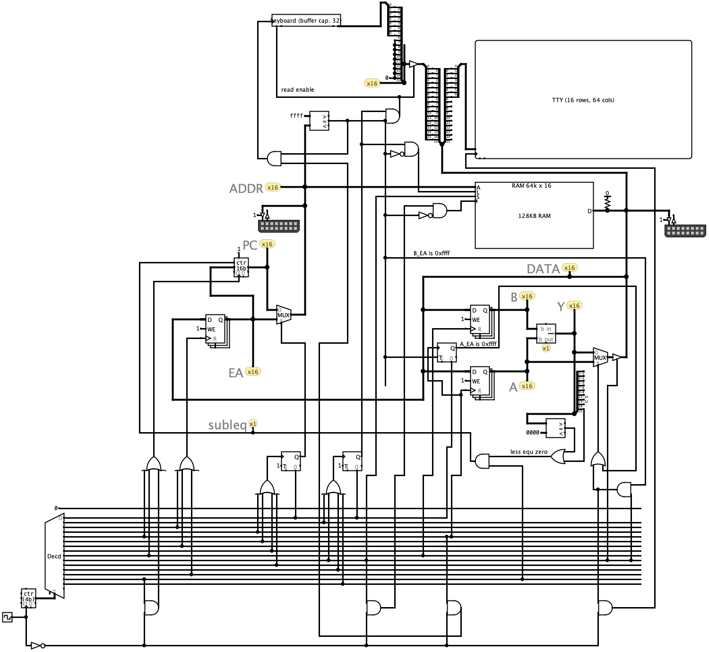
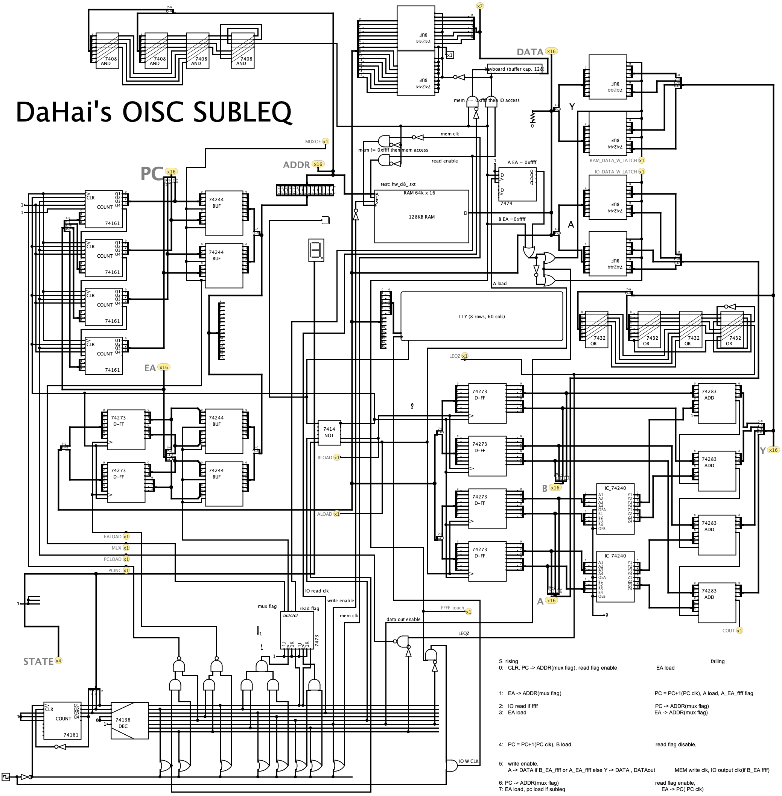

logisim version  
  
  
logisim TTL version  
  
  
我改用logisim-evolution-HC版本進行模擬  
HC版本的模擬器執行速度比較快  

並且加入外部輸入（鍵盤）的機制  
這樣配合原本的輸出機制（tty視窗)就可以構成一部可以互動的電腦  
我先用預設元件進行模擬  
之後再用ttl進行模擬  
最後用實體ttl實現  
rps.txt是「剪刀石頭布」程式，在logisim電路圖中的RAM載入資料時選擇raw格式就可以載入  
rps.txt的源碼修改自：https://github.com/lawrencewoodman/sblasm /examples 感謝lawrencewoodman  
