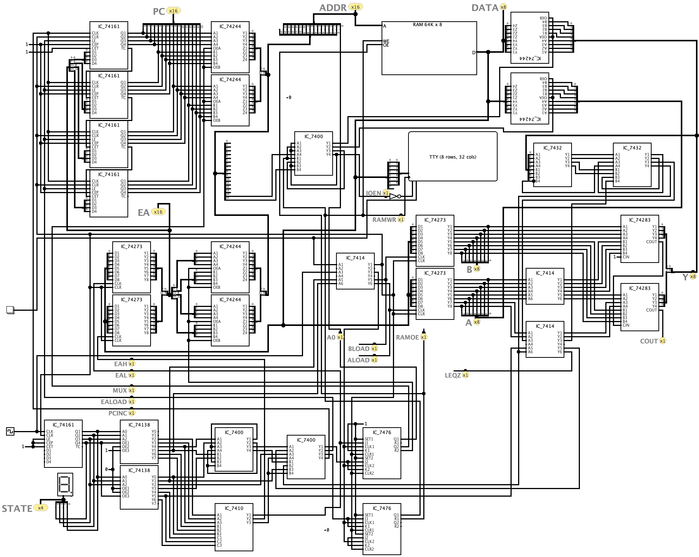
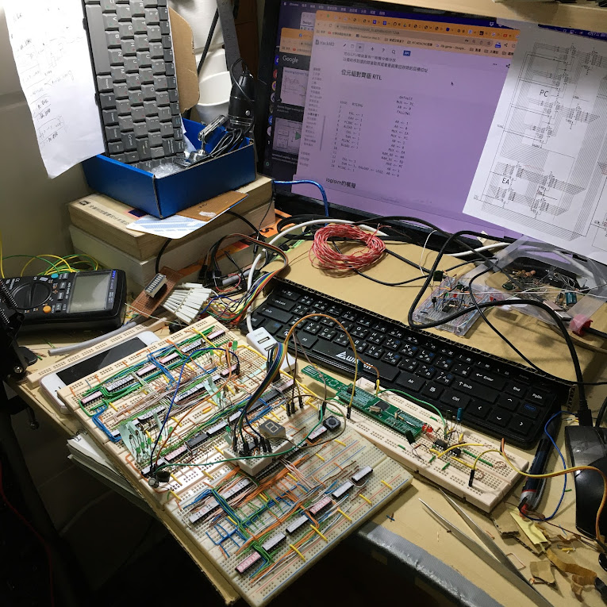

# my_oisc_subleq  
I built a subleq CPU using TTL ICs. I previously completed an 8-bit version, which I successfully simulated in Logisim and then ran on a breadboard. However, the 8-bit architecture (8-bit data bus but 16-bit address bus) has a flaw that prevents the CPU from calculating the address of an indirect address in a program. Therefore, I am currently planning a completely 16-bit version.  
  
I present the previous 8-bit PCB version in this short video: https://www.youtube.com/shorts/maiimB-jLfw
I use the STM32F103 as a simulated RAM, and then I dump the RAM data to the terminal display through the STM32F103's UART. The video is displaying the output of the HELLO WORLD string.  
  
I have more information about my home-made subleq CPU here: https://www.facebook.com/DaHaiDeCPU/photos  
  
logisim version(8bit databus)

breadboard version  

subleq_anima.gif

